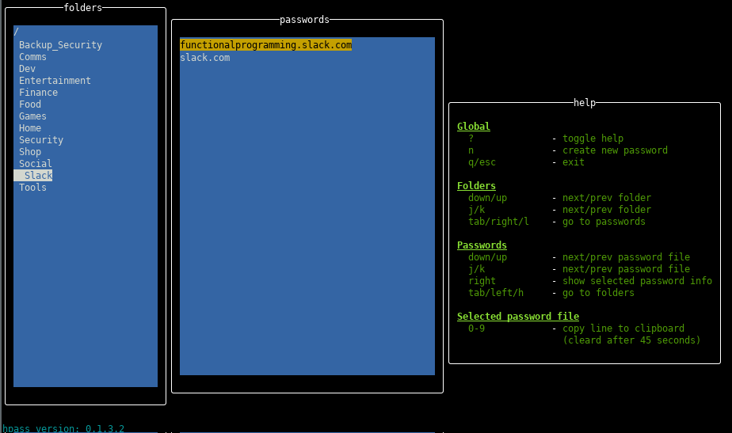
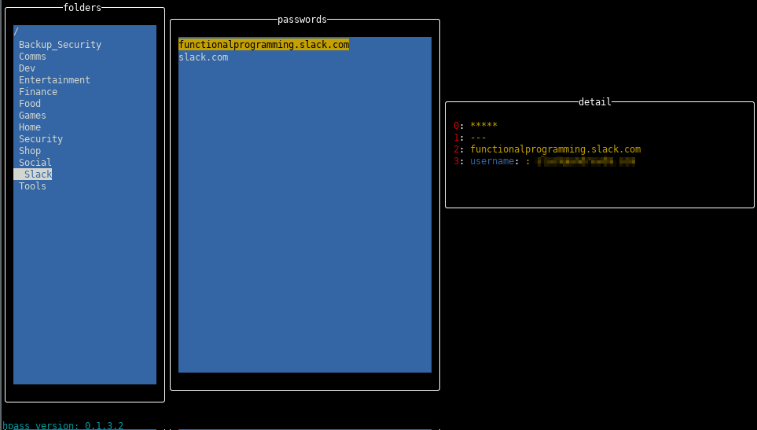
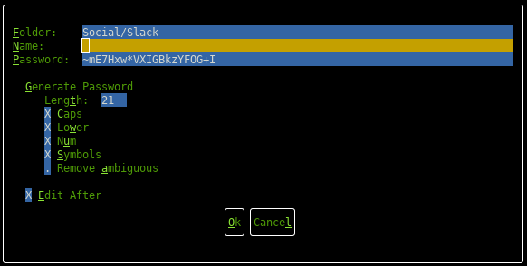
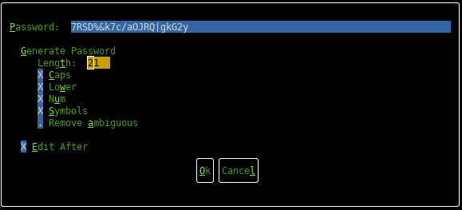

# hpass

Terminal interface for pass

 - **NB** this is still a work in progress, use at your own risk. 
 - Pull requests / issues welcome

## Overview

hpass is a thin wrapper over [pass](https://www.passwordstore.org) written in Haskell using the [Brick](https://github.com/jtdaugherty/brick/blob/master/docs/guide.rst) library.

 - Wrapper over hpass
 - Works with gnome's keyring manager

# Features

## Main screen

List of your password store folders and passwords.

 - Use the `?` to toggle the help
 - Up/down navigates the folders
 - Moving right goes to the password list
 - Pressing 'n' will generate a new password in the selected folder (see below)

## Showing password details

When you move right on a password the details for the password are displayed

 - Use the number keys (0-9) to copy the corresponding line from the password file
 - Pressing 'e' will edit the file (using the `pass edit` functionality)
 - Moving left goes back to the folders (even if password details are being shown)
 - Pressing 'u' will update the password (see below)

## Generate new password

Generate a new password
 
 - Use tab to select the control to edit
 - Alt-x shortcut keys also work. For edit controls the shortcut sets the focus, for checkboxes it toggles the value
 - Set "edit after" to edit the new/updated password file after the password is generated

## Update existing password

Updating a password, generates a new password and adds the old password as an entry at the bottom of the password file

# Known issues

 - [Issue #1](https://github.com/andrevdm/hpass/issues/1) hpass runs pass and captures all stdio/stderr/stdout. So terminal based keyrings wont currently work. 
